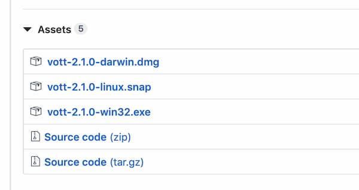
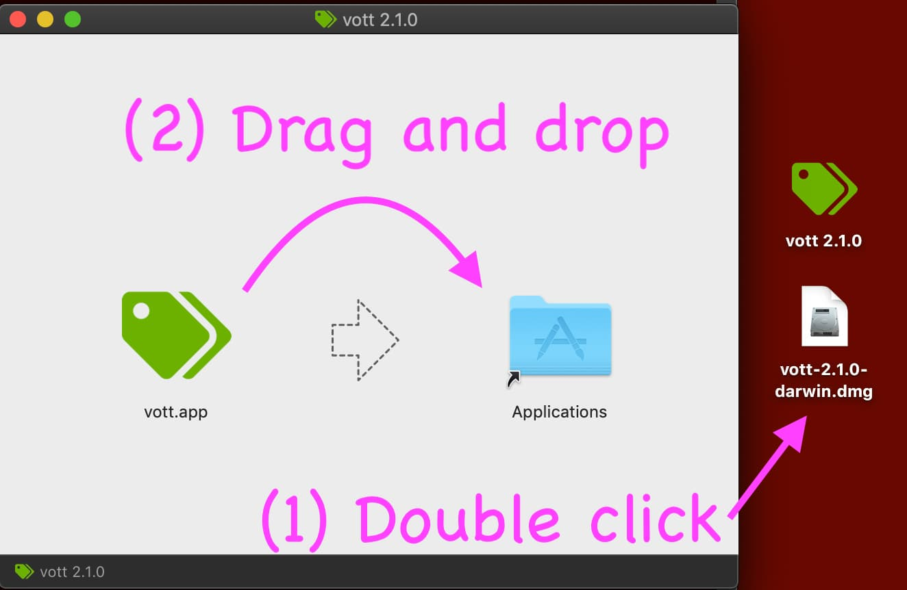
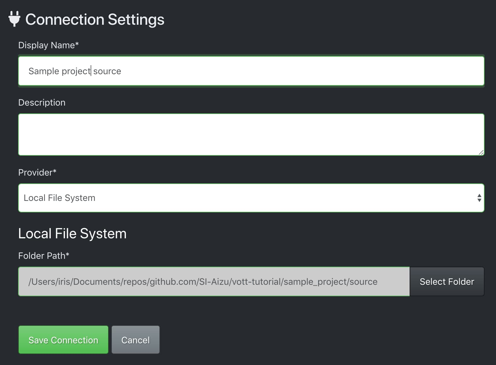
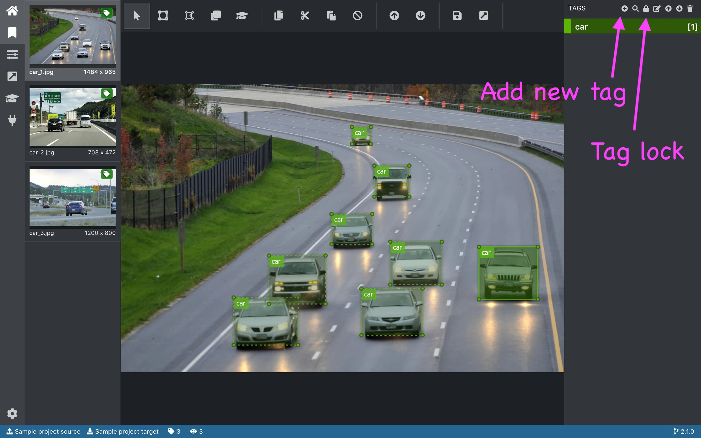
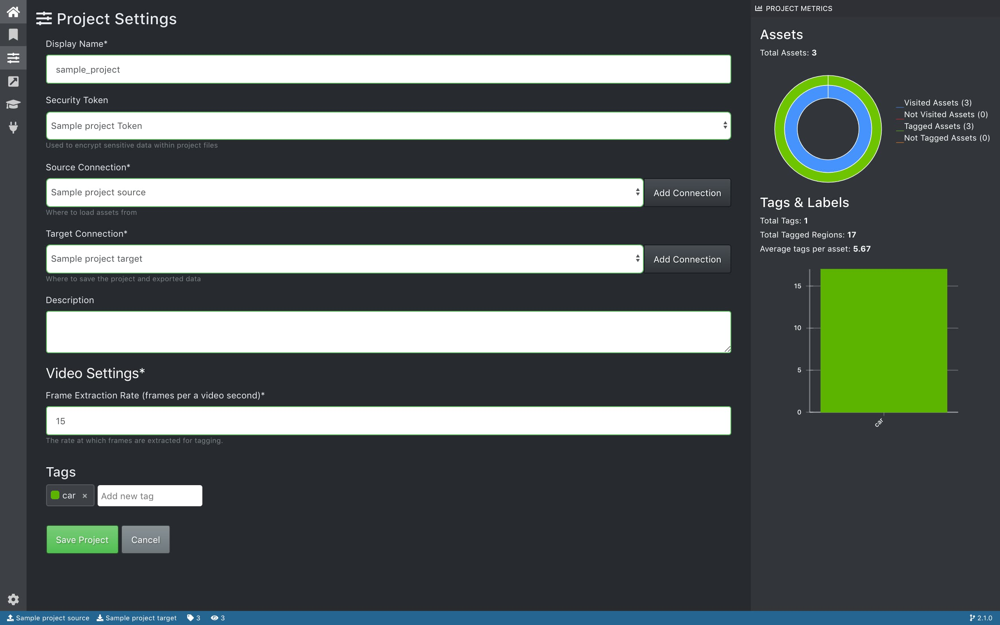
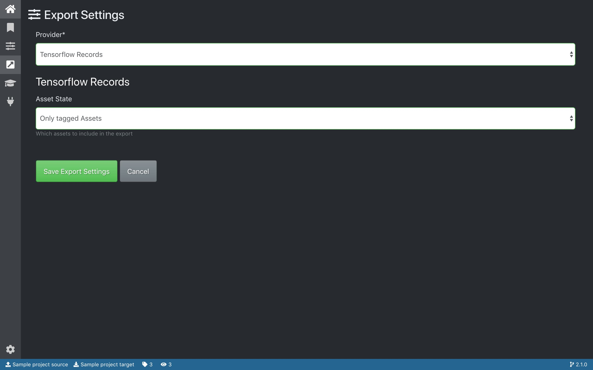
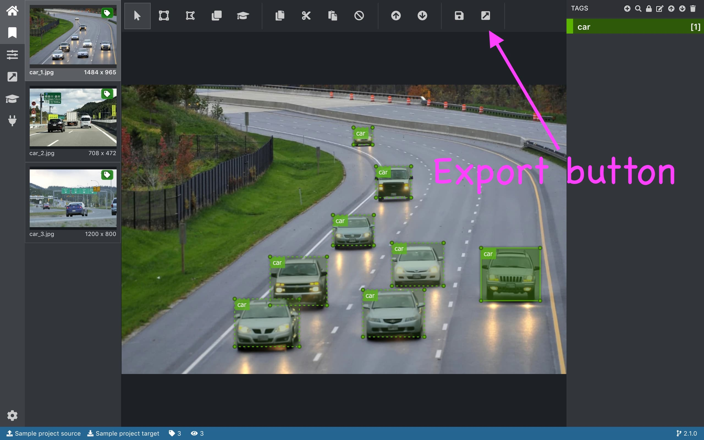

## VoTT Tutorial

Tutorial for annotation with [VoTT v2.1.0](https://github.com/microsoft/VoTT/releases/tag/v2.1.0)

> [microsoft/VoTT - GitHub](https://github.com/microsoft/VoTT)
>
> Visual Object Tagging Tool: An electron app for building end to end Object Detection Models from Images and Videos.


## Table of Contents

<!-- START doctoc generated TOC please keep comment here to allow auto update -->
<!-- DON'T EDIT THIS SECTION, INSTEAD RE-RUN doctoc TO UPDATE -->


- [Download VoTT](#download-vott)
  - [Install to macOS](#install-to-macos)
  - [Install to Linux](#install-to-linux)
  - [Install to Windows](#install-to-windows)
- [Setup project](#setup-project)
  - [Source Connection](#source-connection)
  - [Target Connection](#target-connection)
- [Annotation](#annotation)
  - [Keyboard Shortcuts](#keyboard-shortcuts)
  - [Mouse Controls](#mouse-controls)
  - [Tag ordering](#tag-ordering)
  - [Tag locking](#tag-locking)
- [Check your progress](#check-your-progress)
- [Export dataset](#export-dataset)
- [Open existing project](#open-existing-project)

<!-- END doctoc generated TOC please keep comment here to allow auto update -->


## Download VoTT

Download the VoTT app from the [releases page]. macOS, Linux, and Windows are supported.

[releases page]:https://github.com/microsoft/VoTT/releases



### Install to macOS

1. Download `vott-x.x.x-darwin.dmg`
2. Double click the `dmg` file
3. Drag and drop `vott.app` to `Applications` folder
4. Close the window
5. Eject and remove `dmg` file



### Install to Linux

TBW

### Install to Windows

TBW

<div align="right">
  <a href="#table-of-contents">Back to TOC ☝️</a>
</div>


## Setup project

You can use [vott-tutorial/sample_project] for your tutorial.

[vott-tutorial/sample_project]: https://github.com/SI-Aizu/vott-tutorial/tree/master/sample_project

```
sample_project
├── source
│   ├── car_1.jpg
│   ├── car_2.jpg
│   └── car_3.jpg
└── target
```

1. Open VoTT app
2. Click `New Project`
3. Fill `Display Name`


### Source Connection

1. Click `Add Connection`
2. Fill `Display Name`
3. `Provider`
   1. Select `Local File System`
   2. Select your `source` folder
4. Click `Save Connection`
5. Set the connection to `Source Connection`



### Target Connection

1. Click `Add Connection`
2. Fill `Display Name`
3. `Provider`
   1. Select `Local File System`
   2. Select your `target` folder
4. Click `Save Connection`
5. Set the connection to `Target Connection`

Finally, click `Save Project`

<div align="right">
  <a href="#table-of-contents">Back to TOC ☝️</a>
</div>


## Annotation

You can also view [the video that shows a manner of annotation](https://github.com/SI-Aizu/vott-tutorial/releases/download/v0.1.0/sample.mp4).

### Keyboard Shortcuts

| Shortcut key | Command |
|---|---|
| `W` or `ArrowUp` | Previous Asset |
| `S` or `ArrowDown` | Next Asset |
| `Ctrl + Arrowkey` | Move Region |
| `Ctrl + Alt + Arrowkey` | Shrink Region |
| `Ctrl + Shift + Arrowkey` | Expand Region |

### Mouse Controls

| Mode | Command |
|---|---|
| Two-point mode | Hold down `Ctrl` while creating a region |
| Square mode | Hold down `Shift` while creating a region |
| Multi-select mode | Hold down `Shift` while selecting regions |
| Exclusive Tracking mode | `Ctrl + N` to block frame UI allowing a user to create a region on top of existing regions |

### Tag ordering

Hotkeys of 1 through 0 are assigned to the first ten tags.
These can be reordered by using the up/down arrow icons in in the tag editor pane.

### Tag locking

A tag can be locked for repeated tagging using the lock icon at the top of the tag editor pane.
Tags can also be locked by combining Ctrl or Cmd and the tag hotkey, i.e. `Ctrl + 2` would lock the second tag in the list.



<div align="right">
  <a href="#table-of-contents">Back to TOC ☝️</a>
</div>


## Check your progress



<div align="right">
  <a href="#table-of-contents">Back to TOC ☝️</a>
</div>


## Export dataset




```
sample_project
├── source
│   ├── car_1.jpg
│   ├── car_2.jpg
│   └── car_3.jpg
└── target
    ├── 32db62ab992c250ba2312fdc3babc444-asset.json
    ├── 41e0a9f85a8d20040692c8390317d3ce-asset.json
    ├── 7ce54d9571515f858d958f3a20cd3ff7-asset.json
    ├── sample_project-TFRecords-export
    │   ├── car_1.tfrecord
    │   ├── car_2.tfrecord
    │   ├── car_3.tfrecord
    │   └── tf_label_map.pbtxt
    └── sample_project.vott
```

<div align="right">
  <a href="#table-of-contents">Back to TOC ☝️</a>
</div>


## Open existing project

1. Click `Open Local Project`
2. Select VoTT project file (e.g. `sample_project.vott`)

<div align="right">
  <a href="#table-of-contents">Back to TOC ☝️</a>
</div>
