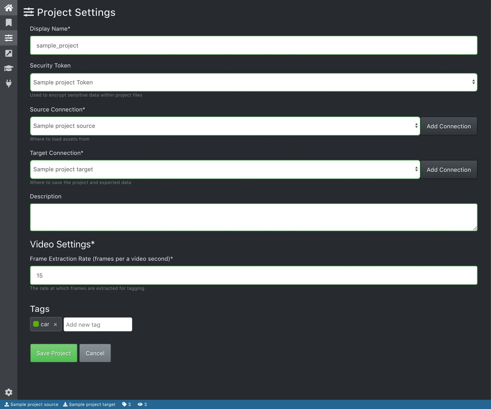
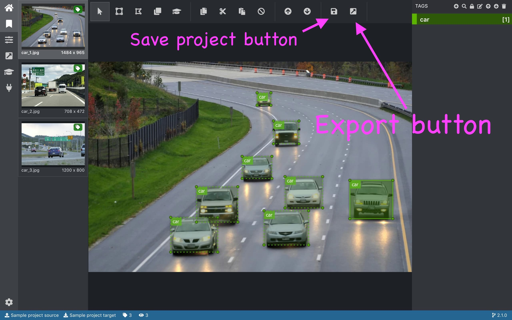

## VoTT Tutorial

Tutorial for annotation with [VoTT v2.1.0](https://github.com/microsoft/VoTT/releases/tag/v2.1.0)

> [microsoft/VoTT - GitHub](https://github.com/microsoft/VoTT)
>
> Visual Object Tagging Tool: An electron app for building end to end Object Detection Models from Images and Videos.


## Table of Contents

<!-- START doctoc generated TOC please keep comment here to allow auto update -->
<!-- DON'T EDIT THIS SECTION, INSTEAD RE-RUN doctoc TO UPDATE -->


- [Download VoTT](#download-vott)
  - [Install to macOS](#install-to-macos)
  - [Install to Linux](#install-to-linux)
  - [Install to Windows](#install-to-windows)
- [Setup project](#setup-project)
- [Annotate](#annotate)
- [Export dataset](#export-dataset)

<!-- END doctoc generated TOC please keep comment here to allow auto update -->


## Download VoTT

Download the VoTT app from the [releases page]. macOS, Linux, and Windows are supported.

[releases page]:https://github.com/microsoft/VoTT/releases


### Install to macOS

1. Download `vott-x.x.x-darwin.dmg`
2. Double click the `dmg` file
3. Drag and drop `vott.app` to `Applications` folder
4. Close the window
5. Eject and remove `dmg` file


### Install to Linux

TBW

### Install to Windows

TBW


## Setup project

1. Open VoTT app
2. Click `New Project`
3. Enter `Display Name`



### `Source Connection`

1. Click `Add Connection`
2. Enter `Display Name`
3. `Provider`
   1. Select `Local File System`
   2. Select your `source` folder
4. Click `Save Connection`
5. Set the connection to `Source Connection`


### `Target Connection`

1. Click `Add Connection`
2. Enter `Display Name`
3. `Provider`
   1. Select `Local File System`
   2. Select your `target` folder
4. Click `Save Connection`
5. Set the connection to `Target Connection`

Finally, click `Save Project`


## Annotation


## Check your progress


## Export dataset




```
sample_project
├── source
│   ├── car_1.jpg
│   ├── car_2.jpg
│   └── car_3.jpg
└── target
    ├── 32db62ab992c250ba2312fdc3babc444-asset.json
    ├── 41e0a9f85a8d20040692c8390317d3ce-asset.json
    ├── 7ce54d9571515f858d958f3a20cd3ff7-asset.json
    ├── sample_project-TFRecords-export
    │   ├── car_1.tfrecord
    │   ├── car_2.tfrecord
    │   ├── car_3.tfrecord
    │   └── tf_label_map.pbtxt
    └── sample_project.vott
```
